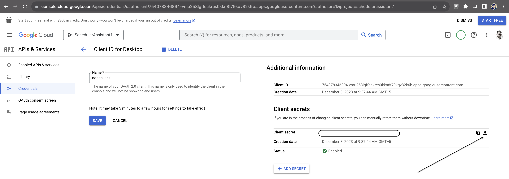

npm install

### Enable calendar in googleapis developer portal
### Download credentials file from google dev portal and save at root as credentials.json

node fetchMyCalendarEvents.js

node MeetingScheduler.js

Welcome to the Meeting Scheduler Assistant!

Schedule a meeting (eg. Find a meetineg time between me, sravankumar.dandra@celigo.com & ritumoni.sarma@celigo.com on tuesday afternoon for 15 mins): 

Find a meetineg time between me, sravankumar.dandra@celigo.com & ritumoni.sarma@celigo.com on thursday

saurabh.jain@celigo.com busy schedule is as follows
From 2023-12-07T10:00:00+05:30 To 2023-12-07T10:30:00+05:30
,From 2023-12-07T11:15:00+05:30 To 2023-12-07T11:30:00+05:30
,From 2023-12-07T11:30:00+05:30 To 2023-12-07T11:45:00+05:30
,From 2023-12-07T12:30:00+05:30 To 2023-12-07T13:00:00+05:30
,From 2023-12-07T12:45:00+05:30 To 2023-12-07T13:15:00+05:30
,From 2023-12-07T13:00:00+05:30 To 2023-12-07T15:00:00+05:30
,From 2023-12-07T14:00:00+05:30 To 2023-12-07T14:30:00+05:30
,From 2023-12-07T14:30:00+05:30 To 2023-12-07T15:00:00+05:30
,From 2023-12-07T15:00:00+05:30 To 2023-12-07T16:00:00+05:30
,From 2023-12-07T15:00:00+05:30 To 2023-12-07T15:15:00+05:30

sravankumar.dandra@celigo.com busy schedule is as follows
From 2023-12-07T10:45:00+05:30 To 2023-12-07T11:00:00+05:30

ritumoni.sarma@celigo.com busy schedule is as follows
From 2023-12-07T10:45:00+05:30 To 2023-12-07T11:00:00+05:30
,From 2023-12-07T11:15:00+05:30 To 2023-12-07T11:30:00+05:30
,From 2023-12-07T13:00:00+05:30 To 2023-12-07T13:15:00+05:30

........................Answer: SJ, based on the busy schedules of you, Sravan Kumar Dandra, and Ritu Moni Sarma on Thursday, December 7, 2023, the following time slots are available for the meeting:

1. From 10:30 AM to 10:45 AM
2. From 11:00 AM to 11:15 AM
3. From 11:45 AM to 12:30 PM
4. From 13:15 PM to 14:00 PM
5. From 16:00 PM to 07:30 PM

Let me know which time slot you prefer, and I can assist in scheduling the meeting.
------------------------------------------------------------